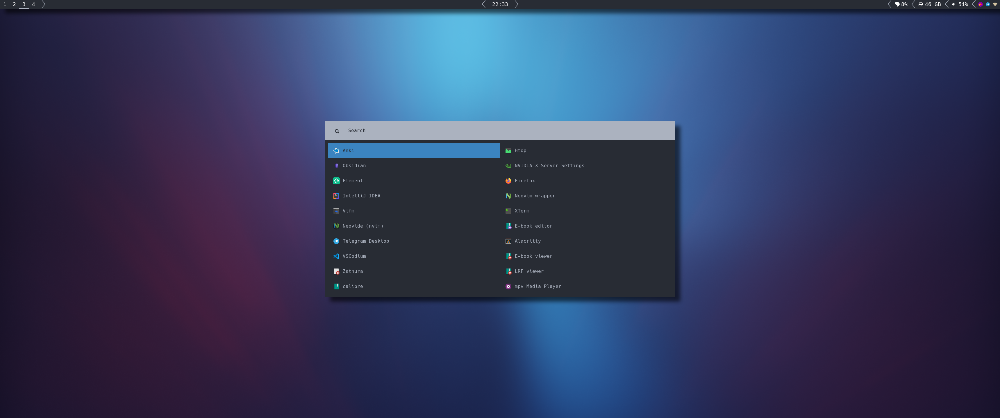

# Dotfiles
System/User wide configuration files in `Nix`

## Installation

> In order to apply the system configuration expression, you need to have [NixOS](https://nixos.org/) installed. It is also mandatory to have [flakes](https://nixos.wiki/wiki/Flakes) enabled.

* To apply the *system* configuration:
    * Clone this repository
    * `cd` into it
    * Execute `./apply-system.sh`

* To apply the *home* configuration:
    * Clone this repository
    * `cd` into it
    * Execute `./apply-home.sh`

## Screenshots

